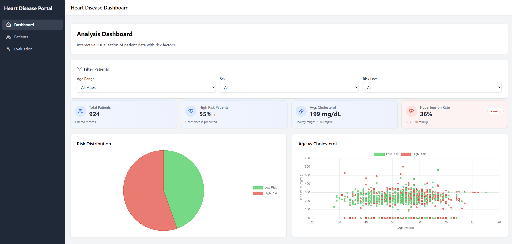
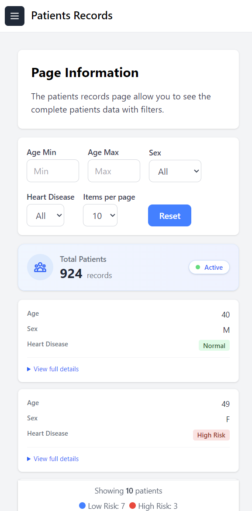

# Healthcare Heart Disease Dashboard with ML Prediction

This project provides a full-stack heart disease prediction solution demonstrating skills across **Machine Learning**, **Software Engineering**, and **Data Analysis**. The objective is to provide an end-to-end solution: from data exploration and model training, to a robust backend API, and a user-friendly frontend dashboard for interactive insights.

<p align="center">
  
  
</p>
<p align="center">
  <em>Left: Dashboard Overview &nbsp; | &nbsp; Right: Patients Mobile View</em>
</p>

---

## Project Overview

* **Data Analysis & ML (Jupyter Notebook):**

  * Location: `data-analysis/heart_disease.ipynb`
  * Purpose: Exploratory Data Analysis (EDA), feature engineering, model training, and evaluation using the Heart Failure Prediction Dataset from Kaggle.
  * Outcome: A serialized ML model (`hd_mdl.pkl`) ready for integration.

* **Backend API (FastAPI):**

  * Location: `backend/`
  * Purpose: Serve the ML model for real-time predictions and manage patient records via RESTful endpoints.
  * Key Components: `create_database.py`, `main.py`, SQLite database, Swagger UI documentation at `/docs`.

* **Frontend Dashboard (React + Vite + Tailwind):**

  * Location: `frontend/`
  * Purpose: Interactive data visualization and user interface for filtering, exploring patient data, and displaying risk predictions.
  * Key Components: Custom React components, Chart.js visualizations, responsive design.

---

## Tech Stack

| Component          | Technology Stack                                                                                |
| ------------------ | ----------------------------------------------------------------------------------------------- |
| Data Analysis & ML | Python, Pandas, NumPy, scikit-learn, Matplotlib/Seaborn (for notebook charts), Jupyter Notebook |
| Backend API        | Python, FastAPI, Uvicorn, SQLite, SQLAlchemy (optional), python-dotenv, joblib                  |
| Frontend Dashboard | TypeScript, React, Vite, Tailwind CSS, Chart.js, react-chartjs-2, Lucide React                  |

---

## Pipeline & Workflow

1. **Data Preparation & Model Training**

   * Conduct EDA in Jupyter Notebook to understand feature distributions and correlations.
   * Perform feature engineering (e.g., encoding categorical variables).
   * Train multiple ML models, evaluate performance, and select the best one.
   * Serialize the final model to `backend/model/hd_mdl.pkl`.

2. **Backend API Setup**

   * Initialize the SQLite database using `backend/database/create_database.py`.
   * Implement REST endpoints in `backend/main.py` for:

     * Predicting heart disease risk (`/predict`).
     * CRUD operations on patient records (`/patients`).
   * Test endpoints via Swagger UI (`/docs`) or Postman.

3. **Frontend Dashboard**

   * Fetch patient data and prediction results from the Backend API.
   * Display interactive charts (pie, scatter, line) and filtering controls.
   * Ensure responsiveness across devices with Tailwind CSS.

4. **Integration**

   * Configure `VITE_API_URL` in `frontend/.env` to point to the Backend.
   * Verify end-to-end functionality: data flows from ML predictions through the API to the dashboard.

---

## Documentation

* **Frontend:** See `frontend/README.md` for setup, running, and customization instructions.
* **Backend:** See `backend/README_backend.md` for DB setup, running the FastAPI app, and API testing.
* **ML Notebook:** Inline comments and markdown cells provide comprehensive explanations of each step.

---

## Getting Started

1. **Clone the Monorepo**

   ```bash
   git clone https://github.com/najikadri/heart-disease-prediction.git
   ```
2. **Explore Data Analysis**

   * Open `data-analysis/heart_disease.ipynb` in Jupyter.
3. **Setup Backend**

   * Navigate to `backend/`, follow instructions in `README_backend.md`.
4. **Setup Frontend**

   * Navigate to `frontend/`, follow instructions in `README.md`.

---

## Contributing

Contributions are welcome!

* Fork the repo and create a feature branch.
* Run tests (if applicable) and ensure code formatting.
* Submit a pull request with a clear description of changes.

---

## Questions & Feedback

Feel free to open issues or reach out to \[[najikadri2000@gmail.com](mailto:najikadri2000@gmail.com)].